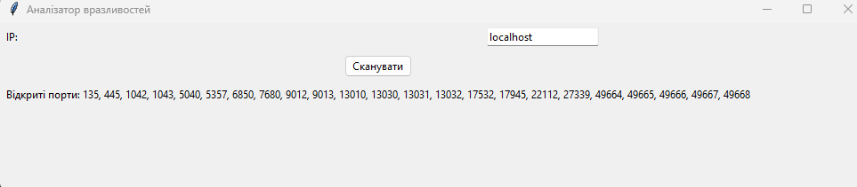

# Tkinter Nmap Scanner

Проста GUI-програма на Python для сканування відкритих портів IP-адреси за допомогою Nmap. Інтерфейс створено на `tkinter`.

## 📷 Інтерфейс



## ⚙️ Можливості
- Сканування відкритих портів на вказаній IP-адресі.
- Графічний інтерфейс не "зависає" під час сканування завдяки використанню багатопоточності.
- Відображення списку знайдених відкритих портів.
- Простий та інтуїтивний інтерфейс.

## 🧠 Як працює
Програма використовує бібліотеку `python-nmap` як обгортку для виклику консольної утиліти Nmap. Сканування виконується в окремому потоці (`threading`), щоб уникнути блокування графічного інтерфейсу `tkinter` під час виконання довгих завдань.

## 📋 Вимоги до системи
Перш ніж почати, переконайтеся, що у вас встановлено наступне:

1.  **Python 3.x**
2.  **Nmap**:
    -   Програму необхідно завантажити з **[офіційного сайту nmap.org](https://nmap.org/download.html)** та встановити у вашій системі.
    -   **❗️ Важливо:** Під час встановлення на Windows переконайтеся, що ви обрали опцію **"Add Nmap's directory to your system PATH"**. Це необхідно для того, щоб Python міг знайти та викликати програму.

## 🚀 Встановлення та запуск

1.  **Клонуйте репозиторій:**
    ```bash
    git clone [https://github.com/ВАШ_НІКНЕЙМ/tk-nmap-scanner.git](https://github.com/ВАШ_НІКНЕЙМ/tk-nmap-scanner.git)
    cd tk-nmap-scanner
    ```

2.  **Встановіть залежності Python:**
    ```bash
    pip install python-nmap
    ```

3.  **Запустіть програму:**
    ```bash
    python My_nmap.py
    ```

## 📁 Структура проєкту
├── My_nmap.py        # Основний файл програми

├── README.md         # Цей файл

└── Screenshot.png    # Скріншот інтерфейсу
